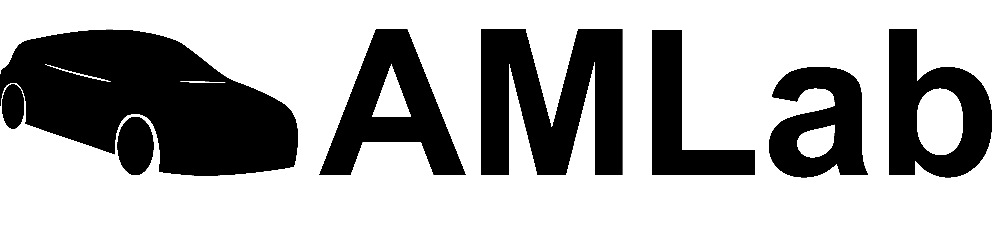

Welcome to Drive-By-Wire documentation!
===================================

Drive-By-Wire system for old cars. Now we have the SAAB

.. Check out the :doc:`usage` section for further information, including
.. how to :ref:`installation` the project.

.. note::

Contents
--------

.. toctree::

   circuit_diagram
   ros2
   esp32
   optimus_drive_launch

See :doc:`optimus_drive_lanch` for how to start everything up and make modifications to the launch configurations.

Vehicle
=======

- Saab 900 I 1989
  - 2.0 Gasoline, 129 kW, Automatic

Component list
============

Software
=========

* Ubuntu 22.04
* ROS2 Humble

