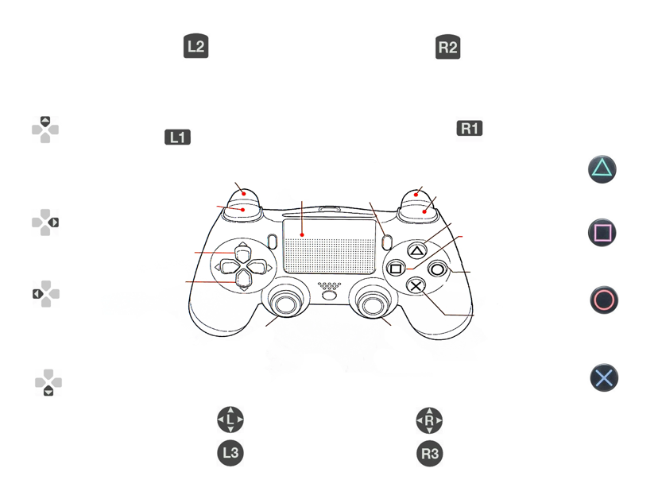

###############
Optimus drive launch
###############

Control Scheme
===============

Buttons must be pressed one at a time or nothing happens!

+--------------------------+--------------------+------------------------------------------------+
| Action                   | Button             | Notes                                          |
+==========================+====================+================================================+
| Shutdown                 | Share + Options    | Press simultaneously until the Jetson Orion    |
|                          |                    | Nano shuts down                               |
+--------------------------+--------------------+------------------------------------------------+
| Brake                    | L2                 | The amount of trigger pulled corresponds to   |
|                          |                    | the brake pushed                              |
+--------------------------+--------------------+------------------------------------------------+
| Brake trim               | L1                 | Allows adjustment of the starting position    |
|                          |                    | of the brake actuator                         |
+--------------------------+--------------------+------------------------------------------------+
| Gas                      | R2                 | The amount of trigger pulled corresponds to   |
|                          |                    | the gas pushed                                |
+--------------------------+--------------------+------------------------------------------------+
| Gas trim                 | R1                 | Allows adjustment of the starting position    |
|                          |                    | of the gas actuator                           |
+--------------------------+--------------------+------------------------------------------------+
| Pedal trim reset         | L1 + R1            | Press simultaneously until both linear        |
|                          |                    | actuators have returned to zero position      |
+--------------------------+--------------------+------------------------------------------------+
| Electrical handbrake     | O                  | Press the brake pedal until the electric      |
|                          |                    | parking brake is released. When the electric |
|                          |                    | parking brake is activated, the other        |
|                          |                    | buttons do nothing.                          |
+--------------------------+--------------------+------------------------------------------------+
| Release electric handbrake| X                 | Releases electric handbrake                   |
+--------------------------+--------------------+------------------------------------------------+
| Steering                 | L Joystick         | Turning the joystick to the left moves the    |
|                          |                    | steering wheel to the left and turning it    |
|                          |                    | to the right moves it to the right           |
+--------------------------+--------------------+------------------------------------------------+
| Steering trim            | Triangle           | Pressing Triangle sets this point as the      |
|                          |                    | new center of the steering wheel             |
+--------------------------+--------------------+------------------------------------------------+

Launchin the Optimus drive
=========================

The car must be started before starting the Jetson Orion Nano!
Once the car is started, turn on the power to the actuator case using its switch. 
Do not connect the controller yet!
Wait 90 seconds and then connect the controller.
Now the Optimus drive is operational.

Always shutdown the Jetson Orion Nano with the controller! Never cut the power off from Jetson Orion Nano while its running!

