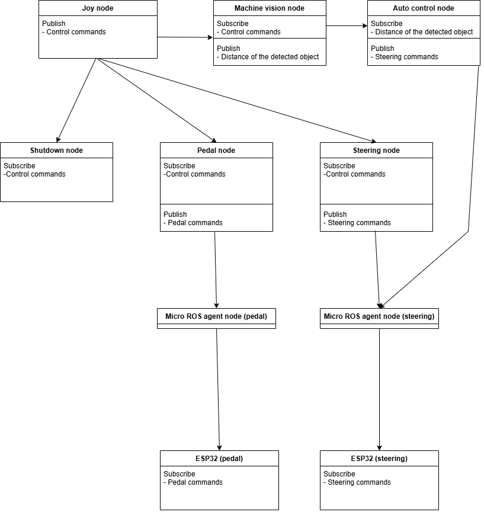

###############
ROS2
###############

ROS2 nodes and relations:
===============

See more information about ROS2 nodes below:

Nodes
--------

.. toctree::

   ros2_nodes/steering
   ros2_nodes/pedal
   ros2_nodes/machine_vision
   ros2_nodes/auto_control
   ros2_nodes/shutdown
   ros2_nodes/micro_ros_agent

Launching the all ROS2 nodes at ones use following line. (except auto control node. For safety reasons it has to be launch separately.)

.. code-block:: bash
    
   ros2 launch my_saab launch.py